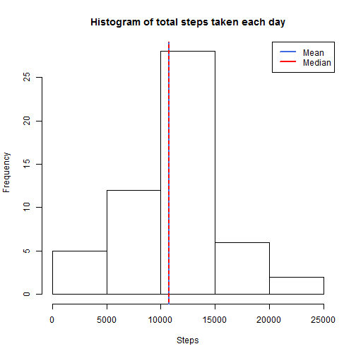
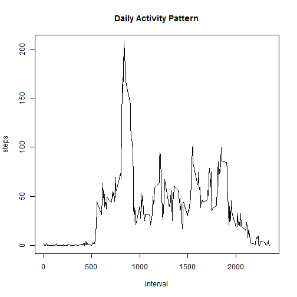
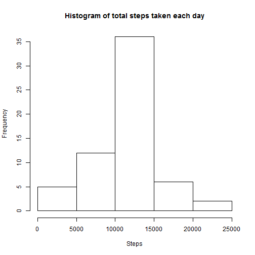
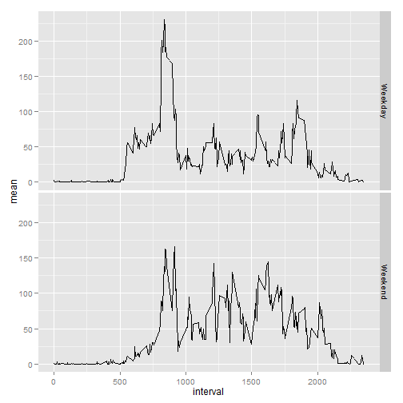

Set working directory to the RepData_PeerAssessment1 folder.


## Loading and preprocessing the data
The data needs to be unzipped.

```r
unzip("activity.zip")
```
Once that is done, the data can be loaded.

```r
df <- read.csv("activity.csv", header=TRUE)
```


## What is mean total number of steps taken per day?
The data is filtered to only include complete records and then the total steps for each day is calculated.


```r
library(plyr)
dfcc <- df[complete.cases(df),]
dfcc$date <- as.Date(as.character(dfcc$date, format="%Y %m %d"))
dfsums<- ddply(dfcc, .(date), summarise, sumsteps = sum(steps))
```

A histogram is generated to show the total number of steps taken each day.


```r
hist(dfsums$sumsteps, main="Histogram of total steps taken each day", xlab = "Steps")

abline(v = median(dfsums$sumsteps),
       col = "red",
       lwd = 2)

abline(v = mean(dfsums$sumsteps),
       col = "royalblue",
       lty = 3,
       lwd = 2)

legend(x = "topright", # location of legend within plot area
       c("Mean", "Median"),
       col = c("royalblue", "red"),
       lwd = c(2, 2, 2))
```

 

The mean and median values can be found using Summary.


```r
summary(dfsums$sumsteps)
```

```
##    Min. 1st Qu.  Median    Mean 3rd Qu.    Max. 
##      41    8841   10760   10770   13290   21190
```


## What is the average daily activity pattern?

The mean value of steps is taken for each interval.


```r
dfintervalmeans <- ddply(dfcc, .(interval), summarise, meansteps = mean(steps))
```


```r
plot(dfintervalmeans, type = "l", ylab = "steps", main = "Daily Activity Pattern")
```

 

The 5-minute interval, which, on average across all the days, that contains the maximum number of steps: 


```r
activeinterval <- subset(dfintervalmeans, dfintervalmeans$meansteps == max(dfintervalmeans$meansteps))
print(activeinterval)
```

```
##     interval meansteps
## 104      835  206.1698
```


## Inputting missing values

The total number of observations with NA values: 

```r
dfduds <- sum(!complete.cases(df))
print(dfduds)
```

```
## [1] 2304
```
The original dataframe is merged with the dfintervalmeans dataframe that was created earlier. In the merged dataframe, the NA values in the steps column will be replaced by the value in the meansteps column.
The total number of steps taken each day is recalculated.


```r
dfmerged <- merge(df, dfintervalmeans)
dfmerged$steps[is.na(dfmerged$steps)] <- dfmerged$meansteps[is.na(dfmerged$steps)]
dfmergedsums<- ddply(dfmerged, .(date), summarise, sumsteps = sum(steps))
```


```r
hist(dfmergedsums$sumsteps, main="Histogram of total steps taken each day", xlab = "Steps")
```

 

The median and mean values of the original data (with NA values removed):


```r
summary(dfsums$sumsteps)
```

```
##    Min. 1st Qu.  Median    Mean 3rd Qu.    Max. 
##      41    8841   10760   10770   13290   21190
```

compared to the values of the data with the inputted values:


```r
summary(dfmergedsums$sumsteps)
```

```
##    Min. 1st Qu.  Median    Mean 3rd Qu.    Max. 
##      41    9819   10770   10770   12810   21190
```

As the NA values were replaced with means, the overall mean value does not change. However filling in the NA values does alter the median and quantile values because there are more observations been taken into account.


## Are there differences in activity patterns between weekdays and weekends?

In order to answer this, the date is processed using the weekdays function and then changed to a factor.


```r
dfmerged$date <- as.Date(dfmerged$date)
dfmerged$wend <- as.factor(ifelse(weekdays(dfmerged$date) %in% c("Saturday","Sunday"), "Weekend", "Weekday"))
dfmerged$day <- weekdays(dfmerged$date)
```

A new aggregated data frame is produced.


```r
dfaggr <- ddply(dfmerged, c("interval", "wend"), summarise, mean = mean(steps))
```

The resulting plot shows the average number of steps taken, averaged across all weekday days or weekend days


```r
library(ggplot2)
myplot <- ggplot(data = dfaggr, aes(x=interval, y=mean, group=1)) + geom_line()
myplot <- myplot + facet_grid(wend~ .)
myplot
```

 

End of Assignment One.
